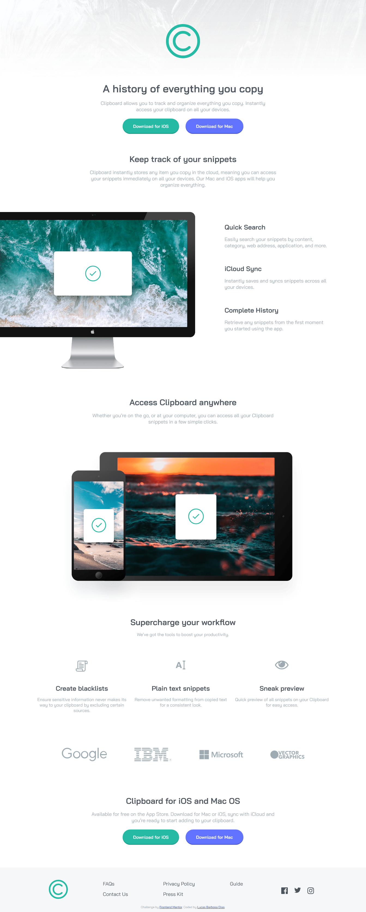

# Sobre este projeto:

Este projeto consiste no segundo desafio imposto para os integrantes da segunda turma do Paketá Academy, ele foi tirado do site:

www.frontendmentor.io/

O desafio consiste em reconstruir a landing page do Clipboard apresentada pelo site da frontendmentor, ela não precisava ser responsiva, o foco é construir ela o mais próximo da original possível, trabalhando assim a estrutura e as semânticas do HTML, e as propriedades de personalização do CSS.

Busco nesse projeto colocar em prática meus estudos sobre Flexbox, e dar inicio ao uso do padrão CSS BEM, por ser meu primeiro contato com padrões em CSS irei buscar me aperfeiçoar em cada projeto a partir de hoje, buscando assim trabalhar com as melhores práticas de desenvolvimento web.

BEM = Bloco, Elemento e Modificador.

# Links:

* Desafio:
    
    https://www.frontendmentor.io/challenges/clipboard-landing-page-5cc9bccd6c4c91111378ecb9

* Minha solução do desafio:

    http://lucasbarbosadias.github.io/landing-page-clipboard

* Sobre o Flexbox:

    https://css-tricks.com/snippets/css/a-guide-to-flexbox/

    https://flexboxfroggy.com/

* Padrão CSS - BEM:

    https://desenvolvimentoparaweb.com/css/bem/

* Como escrever CSS:

    https://tableless.com.br/oocss-smacss-bem-dry-css-afinal-como-escrever-css/

# Resultado Final:

